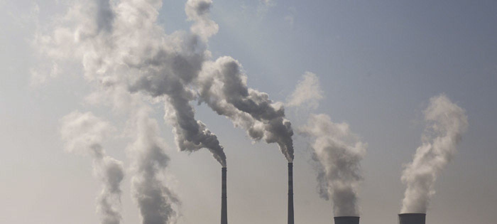
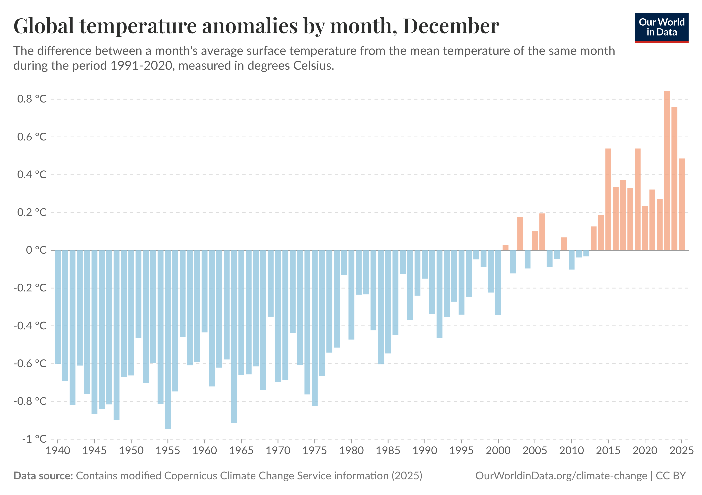
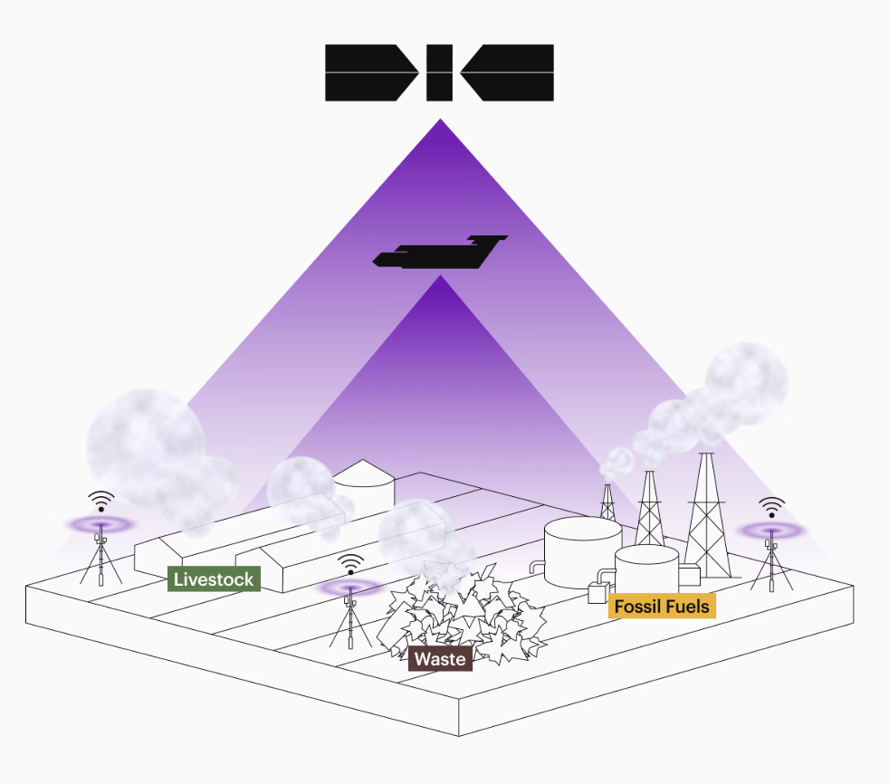
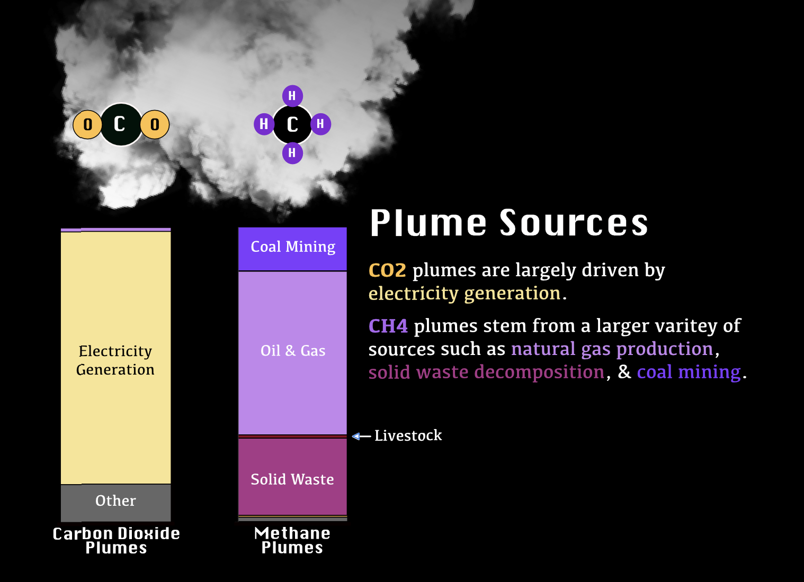
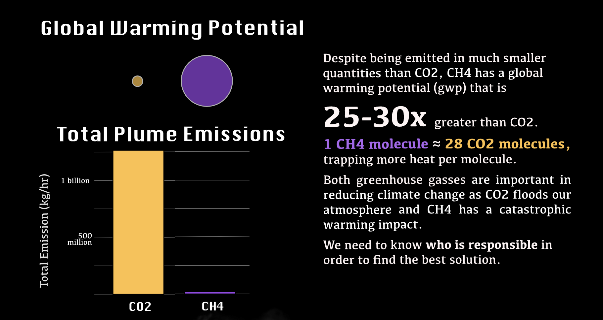
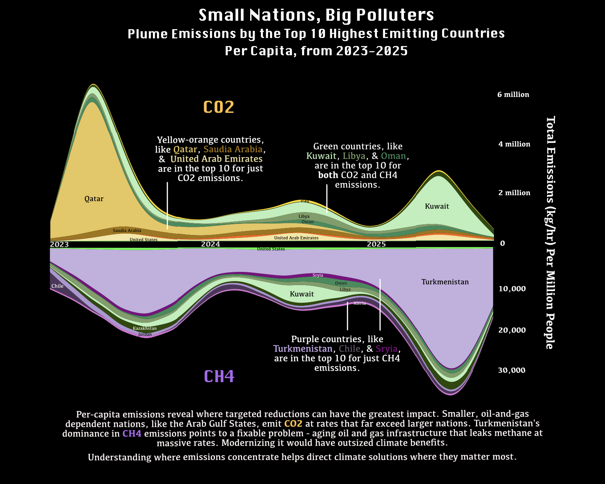

```{r}
#| echo: false
#| output: false
library(jpeg)
library(png)
library(tidyverse)
library(sf)
library(patchwork)
library(ggstream)
```

```{r}
#| echo: false
#| output: false
# Loading in the data 
# Plumes by year
plumes_2016 <- read.csv(here::here("Posts", "plume_infographic","data", "plume_yearly", "export_2016_2017", "export_2016-01-01_2017-01-01.csv")) 
plumes_2017 <- read.csv(here::here("Posts", "plume_infographic","data", "plume_yearly", "export_2017_2018", "export_2017-01-01_2018-01-01.csv")) 
plumes_2018 <- read.csv(here::here("Posts", "plume_infographic","data", "plume_yearly", "export_2018_2019", "export_2018-01-01_2019-01-01.csv")) 
plumes_2019 <- read.csv(here::here("Posts", "plume_infographic","data", "plume_yearly", "export_2019_2020", "export_2019-01-01_2020-01-01.csv")) 
plumes_2020 <- read.csv(here::here("Posts", "plume_infographic","data", "plume_yearly", "export_2020_2021", "export_2020-01-01_2021-01-01.csv")) 
plumes_2021 <- read.csv(here::here("Posts", "plume_infographic","data", "plume_yearly", "export_2021_2022", "export_2021-01-01_2022-01-01.csv")) 
plumes_2022 <- read.csv(here::here("Posts", "plume_infographic","data", "plume_yearly", "export_2022_2023", "export_2022-01-01_2023-01-01.csv")) 
plumes_2023 <- read.csv(here::here("Posts", "plume_infographic","data", "plume_yearly", "export_2023_2024", "export_2023-01-01_2024-01-01.csv")) 
plumes_2024 <- read.csv(here::here("Posts", "plume_infographic","data", "plume_yearly", "export_2024_2025", "export_2024-01-01_2025-01-01.csv")) 
plumes_2025 <- read.csv(here::here("Posts", "plume_infographic","data", "plume_yearly", "export_2025_2025", "export_2025-01-01_2025-10-01.csv")) 

# Combines the years into `plumes`
plumes <- rbind(plumes_2016, plumes_2017, plumes_2018, plumes_2019, plumes_2020, plumes_2021, plumes_2022, plumes_2023, plumes_2024, plumes_2025)


# Make plumes spatial
plumes <- st_as_sf(plumes, coords = c('plume_longitude', 'plume_latitude'), crs = 'EPSG:4326')

counties <- spData::world

# JOIN Plume + Country data 
plumes_country <- st_join(counties, plumes)
```

{fig-align="center"}

## Background

**Understanding Global [Carbon Dioxide]{style="color:#FFBF44;"} & [Methane]{style="color:#7F28D5;"} Plume Emissions**

Greenhouse gas emissions are warming our planet and altering natural processes at alarming rates (Figure 1). Since the industrial revolution, greenhouse gas emissions have dramatically increased. Specifically, carbon dioxide (CO2) increased from 280 parts per million (ppm) to over 410 ppm while methane (CH4) has risen from 700 parts per billion (ppb) to around 1,900 ppb. These greenhouse gasses that now overwhelm our atmosphere absorb and re-emit infrared radiation (heat) in all directions.

All to say, increase in greenhouse gasses (like carbon dioxide and methane), increase our global temperature - this is called **climate change**. Today, sea levels are rising, extreme weather events are becoming more common, and oceans are acidifying due to the rise in greenhouse gasses. Ecosystems, human health, and vital infrastructure are disrupted and even destroyed.

**Emission plumes** are columns of pollutants, mostly greenhouse gasses, that are released into the atmosphere. As a kid, I would always call them "cloud machines" due to the visible cloud-like gas leaking from tall smoke stack. Little did I know, the "cloud machines" were adding to air pollution and climate change.

[{fig-alt="Bar plot showing global temperatures increasing from 1940 to 2025." fig-align="center" width="395"}](https://ourworldindata.org/grapher/global-temperature-anomalies-by-month)

## The data

To reduce greenhouse gas emissions, *Carbon Mapper* uses remote sensing systems to detect, pinpoint, and quantify global plume emission data. They use ground, airborne, and satellite observational tools to find large methane and carbon dioxide emissions events. The plumes' source, location, gas type, and emission rate are recorded. The infograph will majority use the emission rate variable which is the mass of the pollutant released over a given period of time. This collection of data is made accessible to the public to promote transparency, education, and climate action.

[{fig-alt="Image of airborne/satellite observation tool scanning the ground for emission plumes and identifying the source." fig-align="left" width="240"}](https://carbonmapper.org/work)

## Purpose

The goal of this infographic is to further *Carbon Mapper’s* mission: use their public plume data to educate and "promote local climate action, globally." Therefore, the infographic addresses these questions: 

-   What are plumes made of and what are the gasses characteristics? 

-   Who is disproportionately contributing to emission plumes? 

Answering these questions will increase understanding of carbon dioxide and methane emissions and help create tailored solutions to minimize global warming.

You can check out the [full data here](https://github.com/meganhessel/EDS240infographic.git)!

# The Infographic

To see the image better, right-click the image, and select “Open Image in New Tab” to open in a new tab.

```{r fig.width=15, fig.height=10}
#| echo: false
#| eval: true
infographic <- readJPEG(here::here("Posts","plume_infographic", "infographic.jpg"))
plot(as.raster(infographic))
```

# **Visualizations**

## Plume Source Bar Plots

Carbon dioxide is emitted through human activities, mostly through burning of fossil fuels for electricity and other industrial processes. CO2 is stored in trees and soils, known as being “sequestered” within these carbon dioxide sinks. Therefore, deforestation, urbanization, and land-use change removes CO2 from these natural sinks and increases atmospheric CO2 concentration. 

Methane is commonly “leaked” from natural gas systems, such as livestock and solid waste. Livestock’s digestive processes produce and then off-gas CH4. As companies raise these animals in large quantities, CH4 emissions increase. Similarly to the digestive processes, as solid and water waste decomposes in large landfills, CH4 is off-gassed and released into the atmosphere. Industry is the most common methane source. Methane is used to produce, store, and transport oil and natural gas. Furthermore, coal mine methane (CMM) is realized from mines through ventilation systems, degasification/drainage systems, and post-mining activities (such as processes, storage, and transportation). CCM can be captured from the ventilation and drainage systems and used for energy production. 

Understanding the emission sources can lead to creating effective emission reduction programs. By identifying key sources for each greenhouse gas, governments and organizations can tailor policies and strategies for specific emission challenges. Some solutions for emission reduction in each sector include: 

| Plume Source | Solutions |
|------------------------------------|------------------------------------|
| Electricity generation’s carbon dioxide emissions  | Governments and organizations can set up carbon trading systems, a carbon tax, or increase funding on renewable energy sources.  |
| Solid waste’s methane emissions  | Land-fill gas can be captured and used as a renewable energy source.  |
| Livestock’s methane emissions  | Biogas recovery systems capture and utilize natural-by-produces from digestion for clean-burning energy fuel.  |
| Oil and Gas’s methane emissions  | Existing programs to manage these specific emissions are performance standards that limit methane emissions from operations and increase fuel efficiency in transportation.  |

```{r}
#| code-fold: true 
#| output: false

# Data Wrangling 
plumeDF_sector_tot_emission <- plumes %>% 
  group_by(ipcc_sector, gas) %>% 
  summarise(total_emissions = sum(emission_auto, na.rm = TRUE), # Total Emissions 
            .groups = "drop") %>%
  st_drop_geometry() %>% 
  filter(!ipcc_sector == "") # remove data points with no sector listed 


# Methane Sector plot 
plumeDF_CH4_sector_plot <- plumeDF_sector_tot_emission %>% 
  filter(gas == "CH4") %>% 
  ggplot() + 
  geom_bar(aes(x = "", y = total_emissions, fill = ipcc_sector), # Pie chart
           stat="identity", 
           col = "black") + 
  theme_void() + 
  labs(title = "Methane Plumes", 
       fill = "Sector") + 
  theme(plot.title = element_text(size = 13))


# CO2 Sector plot 
plumeDF_CO2_sector_plot <- plumeDF_sector_tot_emission %>% 
  filter(gas == "CO2") %>% 
  ggplot() + 
  geom_bar(aes(x = "", y = total_emissions, fill = ipcc_sector), # Pie chart
           stat="identity", 
           col = "black") + 
  theme_void() + 
  labs(title = "Carbon Dioxide Plumes", 
       fill = "Sector") + 
  theme(plot.title = element_text(size = 13), 
        legend.position = "none")
  
# Plots together 
plume_sector_plot <- (plumeDF_CO2_sector_plot | plumeDF_CH4_sector_plot) 


```

{fig-alt="Proportional stacked bar plot of sector emissions for CH4 and CO2. CO2 emission are main from electricity generation, whereas CH4 emissions are from oil & gas, solid waste, and coal mining." width="497"}

## Greenhouse Gas Background Plots

Carbon dioxide has a much higher atmospheric concentration than methane as it is emitted through the burning of fossil fuels, deforestation, and industrial processes. Methane, on the other hand, is emitted through a larger variety of sources including solid waste, natural gas and petroleum systems, and livestocks. Since pre-industrial times, both greenhouse gas emissions have increased with human activities, just at different rates and concentrations. While CO2 concentration is much greater than than CH4, methane has 25-30 times greater global warming potential (gwp). This means that one CH4 molecule absorbs the same infrared radiation (heat) as 25-30 CO2 molecules over 100 years. In a 20 year time period, methane traps 81-83 more heat than carbon dioxide.This is important because both greenhouse gases have vastly different concentrations and global warming potentials which makes them both very important to climate change. Understanding both gasses characteristics and trends will help create effective climate action solutions. 

```{r}
#| code-fold: true 
#| output: false

# gas colors 
gas_pal <- c("CH4" = "#7F28D5", 
             "CO2" = "#FFBF44")

# Total emission plot 
gas_total_emissions <- plumes %>% 
  group_by(gas) %>% 
  summarise(emission_auto = sum(emission_auto, na.rm = TRUE)) %>% 
  st_drop_geometry() %>% 
  ggplot() + 
  geom_col(aes(x = gas, y = emission_auto, fill = gas), col = "black") + 
  scale_fill_manual(values = gas_pal) +
  theme_minimal() + 
  labs(y = "Total Emission (kg/hr)") + 
  theme(axis.title.x = element_blank(), 
        legend.position = "none")


# GWP Comparison Circle chart
gwp <- data.frame(gas = c("CO2", "CH4"), 
                  life_time = c(500, 12.4), # Chem life times 
                  gwp = c(1,28)) # global warmining potential
gas_gwp_plot <- ggplot() +
  geom_point(data = gwp, 
             mapping = aes(x = gas, y = 0, size = gwp, fill = gas), 
             shape = 21, color = "black", alpha = 0.7) +
  scale_size_area(max_size = 20) +  # Ensures area ~ value
  coord_fixed(ratio = 5) +          # Keep circles round
  theme_minimal() +
  scale_fill_manual(values = gas_pal, guide = "none") + 
  labs(
    title = "Global Warming Potiential (gwp)",
    size = "Value"
  ) +
  theme(axis.text.y = element_blank(),
        axis.ticks.y = element_blank(), 
        axis.title.y = element_blank(), 
        axis.title.x = element_blank(), 
        legend.position = "none")

gas_gwp_plot / gas_total_emissions

```

{fig-alt="Bar chart showing CO2 has over 1 billion total emissions, towering over methane abundance. On the other hand, Methane has 25-30 times higher global warming potential which is displayed in a circle area proportional chart."}

## Emission Per Country St**r**eam Plot

To understand the distribution of plume emissions on spatial and temporal scales, I created a stream plot. This plot type illustrated how carbon dioxide and methane emission rates rise and fall overtime in the top emitter countries. CO2 and CH4 are emitted at completely different rates. Having CO2 emission rates extend upwards and CH4 emission rates extend downwards allows for two different y-axis in order to compare the peaks and troughs of the greenhouse gas emission rates. 

Carbon dioxide plume emissions seem to be denominated by Qatar in the early 2020s who then had a steep plume emission die off in 2024. Since then, Kuwait has taken the lead for CO2 emissions per million of people. Kuwait also emits a large amount of methane. Most importantly, Turkmenistan has consistently been the lead methane emitter. 

The per-capita framing reveals that smaller, oil-and-gas-dependent nations contribute disproportionately to plume emissions relative to their population size.

```{r}
#| code-fold: true
#| output: false 

# Data wrangling 
plumes_per_country <-plumes_country %>% 
  st_drop_geometry() %>% 
  group_by(name_long, year = year(datetime), month = month(datetime), gas) %>%  # Find avg and sum for each month of each year 
  summarise(total_emissions = sum(emission_auto, na.rm = TRUE),
            avg_emissions = mean(emission_auto, na.rm = TRUE),
            pop = mean(pop),
            .groups = "drop") %>%
  mutate(year_dec = year + (month - 1) / 12, #decimal year 
         emission_total_capita = (total_emissions/pop), 
         emission_per_million = (total_emissions/pop) * 1e6) # per 1 million people


# Top 10 green house gas emitters 
top_countries_CH4 <- plumes_per_country %>%
  filter(gas == "CH4") %>%
  group_by(name_long) %>%
  summarise(total = sum(emission_per_million)) %>%
  slice_max(total, n = 10) %>%
  pull(name_long)


top_countries_CO2 <- plumes_per_country %>%
  filter(gas == "CO2") %>%
  group_by(name_long) %>%
  summarise(total = sum(emission_per_million)) %>%
  slice_max(total, n = 10) %>%
  pull(name_long)


# Plot for CH4
plumes_per_country %>% 
  filter(gas == "CH4", 
         year >= 2023, 
         name_long %in% top_countries_CH4) %>% 
  #mutate(emission_per_million = -emission_per_million) %>% 
  ggplot(aes(x = year_dec, #  use decimal year 
             y = emission_per_million, 
             fill = name_long)) +
  geom_stream(type = "ridge",  bw = 0.85) + 
  geom_stream_label(aes(label = name_long), 
                    type = "ridge", 
                    size = 2.5) +
  labs(fill = "Countries") +
  theme_minimal() + 
  theme(axis.title.y = element_blank(), 
        axis.title.x = element_blank())


# Plot for CO2
plumes_per_country %>% 
  filter(gas == "CO2", 
         year >= 2023, 
         name_long %in% top_countries_CO2) %>% 
  ggplot(aes(x = year_dec, #  use decimal year 
             y = emission_per_million, 
             fill = name_long)) +
  geom_stream(type = "ridge",  bw = 0.85) + 
  geom_stream_label(aes(label = name_long), 
                    type = "ridge", 
                    size = 2.5) +
  labs(fill = "Countries") +
  theme_minimal() + 
  theme(axis.title.y = element_blank(), 
        axis.title.x = element_blank())
```

{fig-alt="Stream plot illustrating Qatar and Kuwait emit disproportional CO2 concentrations, and Turkmenistan dominate CH4 emissions."}

# **Design Elements**

::: panel-tabset
## Graphic Form

**Graphic Form:** I used various plot types. Each graphic form was chosen to appeal to the "common person." The goal is to find the most minimalistic way to convey the plot's message. Therefore, I use commonly known and recognizable plot types such are bar, circle, and stream plots

The bar and circle plots compare the proportion of CO2 and CH4 abundance and global warming potential. The proportional stack bar chart illustrates the difference between the gasses' plume sources. Finally, the stream plot allows the ability to examine how countries' emissions changed overtime.

## Text

**Text:** All of my text was edited or added in Affinity. Affinity offers flexibility with captions, lables, texts, and titles. These elements can be easily changed overtime as I continually alter the infographic.

For the topography, I wanted a clean, industrial-like font as the titles and a more simple, yet professional font for the sub-text. With numbers in the axises and text boxes, the fonts being mono-spaced (which is where all numbers and letters have the same width) was important. Therefore, I decided on Krungthep font for titles and kefa font for any sub-text.

## Themes

**Themes:** Plot themes were kept simple by including only essential information. I removed axis titles and grid lines when necessary.

## Colors

**Colors:** The color choices are picked from [Carbon Mapper’s website](https://carbonmapper.org/) who supplied all data used for the infographic. The carbon dioxide and methane colors are an orange-yellow and a purple which are Carbon Mapper’s main color theme and color-blind friendly. The orange-yellow represents CO2 emission characteristics while the purple represents CH4 emission characteristic for each plot and text feature.

Additionally, plumes are a heavy and dark topic. Therefore, the dark background color is to portray the same gloomy feeling. 

{fig-alt="Color swatches: yellow-orange and purple" width="201" height="79"}

{fig-alt="Carbon Mapper's logo" width="217"}

## General Design

**General Design:** The inforgraphic is divided into 3 parts: gas sources, gas characteristics, and country emissions overtime. As people typically read left to right, the gas sources and characteristics are on the left side to build the "story." After absorbing the introductory information, such as abundance, gwp, and industry polluters, the viewer’s eye naturally flows to the right, where they engage with the more complex stream plot.

The color scheme is designed to support the overall layout. All orange-yellow plot elements and text relate to CO2 information, while purple plot elements and text represent CH4 information. This consistent use of color makes it easier to compare all three sections of the infographic.

## Message

**Message:**

Most climate conversations focus on total emissions, which typically target the Unites States, China, and India. But total emissions only tell part of the story. This inforgraphic dives deeper into per-capita and per-source emission trends to uncover where actionable climate solutions are possible.

In the stream plot, we learn Turkmenistan emits more methane per capita than any other country in the dataset. Turkmenistan oil and gas infrastructure was developed during the Soviet era in the 1900s (International Methane Emissions Observatory, 2025). The country's vital pipelines are deteriorating and leaking large amounts of methane into the atmosphere (International Methane Emissions Observatory, 2025). With international investment and cooperation to help modernize its infrastructure, Turkmenistan represents one of the highest-leverage opportunities to reduce global CH4 emissions.

The Arab Gulf States include Saudi Arabia, United Arab Emirates (UAE), Qatar, Kuwait, Bahrain, and Oman. Many of these countries have the highest CO2 emissions per capita because of their heavy fossil fuel dependency and high energy consumption. Transitioning these energy systems toward sustainable alternatives, supported by governance reform, could yield significant emission reductions.

The goal is NOT to point figures. It's to inspire targeted, cooperative action. Climate solutions are not a "one-size-fits-all." Therefore, knowing where emissions concentrate helps us direct efforts where they matter most.

## Accessibility

**Accessibility:** The yellow-orange and purple palette is color blind friendly, ensuing contrats remain distinguishable. The countries in stream plot required more colors, making full colorblind compliance difficult. Nevertheless, every trend is labeled and explained in the accompanying text so the data remains accessible to all readers. Furthermore, all images and figures have alt text ensuring accessibility for visually impaired users.

## DEI

**Diversity, Equity, and Inclusion (DEI):** Accessibility and equity were central considerations in this infographic. Color choices and text elements were made with colorblind accessibility in mind. Alt text was added to ensure a broad audience could understand the material. Beyond visual accessibility, the framing of this infographic was intentional. Climate narratives often center large, wealthy nations while overlooking the historical and economic context of smaller ones. Looking at emissions per-capita allows for understanding of countries like Turkmenistan who inherited deteriorating Soviet-era infrastructure and the Gulf states whose systems were built on fossil fuels before climate consequences were understood. This goal of the infographic is to NOT point fingers. It recognizes that equitable climate solutions require understanding each country's unique constraints and opportunities. This study acknowledges that the countries highlighted are not historical drivers of climate changes; they are the current countries needing solutions.
:::

```{r}
#| code-fold: true 
#| output: false

# Load in libraries 
library(jpeg)
library(png)
library(tidyverse)
library(sf)
library(patchwork)
library(ggstream)

# Loading in Carbon Mapper  data 
# Plumes by year
plumes_2016 <- read.csv(here::here("Posts", "plume_infographic","data", "plume_yearly", "export_2016_2017", "export_2016-01-01_2017-01-01.csv")) 
plumes_2017 <- read.csv(here::here("Posts", "plume_infographic","data", "plume_yearly", "export_2017_2018", "export_2017-01-01_2018-01-01.csv")) 
plumes_2018 <- read.csv(here::here("Posts", "plume_infographic","data", "plume_yearly", "export_2018_2019", "export_2018-01-01_2019-01-01.csv")) 
plumes_2019 <- read.csv(here::here("Posts", "plume_infographic","data", "plume_yearly", "export_2019_2020", "export_2019-01-01_2020-01-01.csv")) 
plumes_2020 <- read.csv(here::here("Posts", "plume_infographic","data", "plume_yearly", "export_2020_2021", "export_2020-01-01_2021-01-01.csv")) 
plumes_2021 <- read.csv(here::here("Posts", "plume_infographic","data", "plume_yearly", "export_2021_2022", "export_2021-01-01_2022-01-01.csv")) 
plumes_2022 <- read.csv(here::here("Posts", "plume_infographic","data", "plume_yearly", "export_2022_2023", "export_2022-01-01_2023-01-01.csv")) 
plumes_2023 <- read.csv(here::here("Posts", "plume_infographic","data", "plume_yearly", "export_2023_2024", "export_2023-01-01_2024-01-01.csv")) 
plumes_2024 <- read.csv(here::here("Posts", "plume_infographic","data", "plume_yearly", "export_2024_2025", "export_2024-01-01_2025-01-01.csv")) 
plumes_2025 <- read.csv(here::here("Posts", "plume_infographic","data", "plume_yearly", "export_2025_2025", "export_2025-01-01_2025-10-01.csv")) 

# Combines the years into `plumes`
plumes <- rbind(plumes_2016, plumes_2017, plumes_2018, plumes_2019, plumes_2020, plumes_2021, plumes_2022, plumes_2023, plumes_2024, plumes_2025)

# Make plumes spatial
plumes <- st_as_sf(plumes, coords = c('plume_longitude', 'plume_latitude'), crs = 'EPSG:4326')

# Add country data 
counties <- spData::world

# JOIN Plume + Country data 
plumes_country <- st_join(counties, plumes)

# Create color palettes 
gas_pal <- c("CH4" = "#7F28D5", 
             "CO2" = "#FFBF44")

sector_color_pal <- c("Coal Mining (1B1a)" = "#321F64",
                      "Waste Water (6B)" = "#BBBBBB",
                      "Oil & Gas (1B2)" = "#6C67DF",
                      "Livestock (4B)" = "#FFB13E", 
                      "Solid Waste (6A)" = "#ED5713",
                      "Electricity Generation (1A1)" = "#20E6AC",
                      "Other" = "#7B0301")
# blah blah blah blah 

```

# References

<https://www.xylem.com/en-us/markets/agriculture/biogas-recovery/>

<https://www.epa.gov/cmop/about-coal-mine-methane>

<https://www.epa.gov/climateleadership/ghg-reduction-programs-strategies#Supply_Chain>

<https://www.epa.gov/controlling-air-pollution-oil-and-natural-gas-operations/epas-final-rule-reduce-methane-and-other>

<https://unece.org/sites/default/files/2025-12/1.%20Current%20state%20of%20emissions%20in%20Turkmenistan.pdf>

Methane Imagery and Data © Carbon Mapper, https://data.carbonmapper.org
