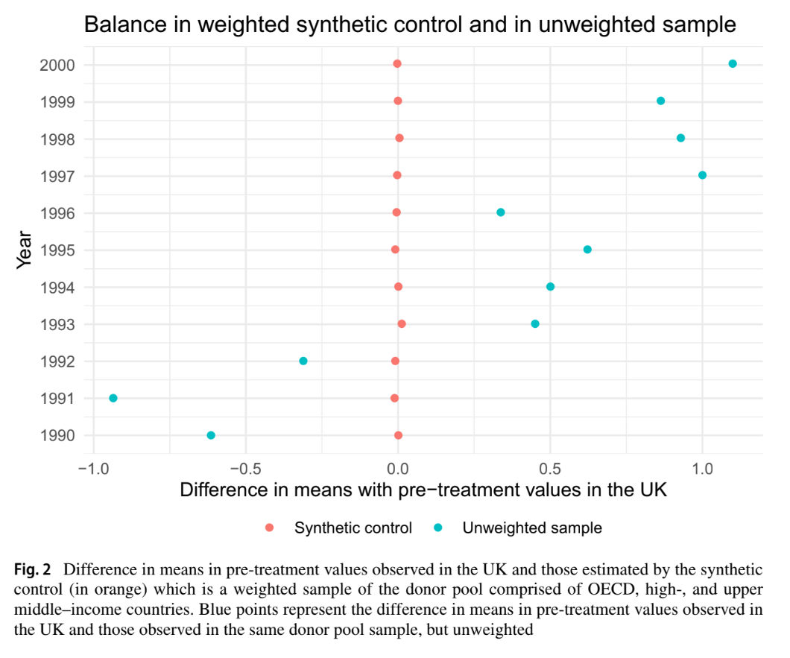

{fig-alt="Image of industrial smokestacks."}

## Outline

-   Study background and introduction
-   Data explanation
-   Synthetic control generation and assessment
-   Evaluating treatment effect- gap plots
-   Robustness checks: placebo, weights, MSPE ratio, balance table
-   Final balance plot comparison
-   Conclusion

All work on this project can be found on our [GitHub Repository](https://github.com/NatBonnet/EDS241-UK-synthetic-control-final).

## Lépissier & Mildenberger (2021)

This analysis aims to reproduce the results of Lépissier and Mildenberger's (2021) study, *Unilateral Climate Policies Can Substantially Reduce National Carbon Pollution*. The authors employed a synthetic control method (SCM) to estimate the causal effect of the UK’s 2001 Climate Change Programme (CCP) on the country’s carbon emissions. Their main finding demonstrates that CCP reduced the UK's carbon emissions. CO2 emissions per capita were 9.8% lower in 2005 relative to what they would have been if the CCP had not been passed, demonstrating that unilateral climate policies can still reduce carbon emissions even in the absence of a binding global climate agreement.

## The Fundamental Problem & the Synthetic Control Method (SCM) Fix

The 2001 UK CCP is a complex reform that included a carbon tax on large-scale energy users, industry-negotiated exemptions from the tax for meeting reduction targets, and a voluntary emissions trading scheme. It was one of the first comprehensive climate reform packages passed globally, in advance of action by most other Organisation for Economic Co-operation and Development (OECD) countries.

We are interested in understanding what the UK's carbon emissions might have looked like had the CCP not been enacted. To do so we need to create a strong counter factual to simulate what *would* have happened. The authors take the synthetic control method (SCM) to manufacture a synthetic UK. This approach is less restrictive than a difference-in-difference strategy would be to compare other countries without a carbon policy. A SCM method uses weighted elements of donor countries to create a more accurate synthetic counterfactual, where a DiD method must use the complete picture of existing similar data.

The synthetic UK is the combination of weighted averages of counties that did not receive the policy intervention. To create the best-fit synthetic UK, donor country emissions are weighted to match UK pre-treatment emissions trends. Countries are given higher weights if they more closely match observed pre-treatment trends in the UK.

## Assessing Treatment Effect

The gap between the synthetic and real UK after policy intervention is observed as the treatment effect.

Before the 2001 policy: Real UK $\approx$ Synthetic UK.

After the 2001 policy: The gap between the real UK and synthetic UK = *Treatment effect.*

## Research Questions

**Did United Kingdom's 2001 Climate Change Programme (CCP) reduce per capita CO₂ emissions?**

-   $Y$ (outcome): Per capita CO₂ emissions generated from fossil fuels and the manufacture of cement (power sector) (`EN.ATM.CO2E.PC`)

-   Treated unit: United Kingdom (`UK`)

-   Treatment year: 2001

-   Donor pool: 51 countries with...

    -   \(1\) in Organisation for Economic Co-operation and Development (OECD) or classified by the World Bank as upper middle–income (UMC) or high-income (HIC) countries at the time of treatment in 2001

    -   \(2\) Population greater than 250,000

    -   \(3\) No carbon pricing policy

**How do different donor pools impact the SMC results and robustness checks?**

-   In this study, we investigate and run SCM for 3 different donor pools. This positions the UK's CCP to be evaluated against a wide pool of donor countries by pre-treatment carbon emissions:

    -   \(1\) Countries with similar economic conditions to the UK - in the OECD.

    -   \(2\) High income counties (HIC) with similar economic conditions to UK (OECD).

    -   \(3\) High and upper-middle income (HIC and UMC) counties with similar economic conditions to UK (OECD).

The Work Bank classifies countries into income categories according to Gross National Income (GNI) per capita in US dollars. In fiscal year 2001, the World Bank classified high-income (HIC) countries as those with GNI per capita above 9,265 US\$ and upper middle–income (UMC) countries as those with GNI per capita in the 2,996 US\$ to 9,265 US\$ range. “EN.ATM.CO2E.PC” (CO2 emissions per capita in metric tons).

Additionally, only countries with a population greater than 250,000 without a carbon pricing policy in place in 2001 were considered for the donor pool.

## Data

| Data Name | Includes |
|----------------------------|--------------------------------------------|
| `data` | Carbon emissions data from all accessible countries. Includes 157 countries. |
| `data_OECD` | Carbon emissions from countries with similar economic conditions to UK. Includes 23 countries. |
| `data_OECD_HIC` | Carbon emissions from high income counties with similar economic conditions to UK. Includes 33 countries. |
| `data_OECD_HIC_UMC` | Carbon emissions from high and upper-middle income counties with similar economic conditions to UK. Includes 51 countries. |

## Study Assumptions

-   \(1\) Stable unit treatment values assumption (SUTVA): There is no spillover of CCP enactment to other countries in the donor pool.

-   \(2\) Variables used to form the weights must have values for donor pool countries that are similar to those of the UK. This minimizes interpolation bias. Interpolation bias introduces error by assuming a smooth or linear relationship between data points. Our procedure interpolates across regions with very different characteristics, so we use more similar countries to reduce inaccurate assumptions.

-   \(3\) Strong pretreatment fit between synthetic UK and actual UK. The only credible way to assess treatment effect is by comparing against a strong counter factual, which needs to behave essentially the same as the actual UK.

### Study approach to address assumptions

-   \(1\) Authors selected the donor sample based on countries that had not passed any major climate legislation until the 2005 European Union's Emissions Trading Scheme (EU ETS). The UK was the only country with the CCP in 2001. This attempts to get the best possible causal effect calculation while minimizing spillover effects. By comparing countries without unilateral climate policies in place, we more accurately represent what *would* have happened given no policy.

-   \(2\) Interpolation bias can become critial when assessing various countries with very different characteristics. To avoid interpolation bias, the study used per capita emissions and used weights from similar countries when creating the donor pool. Per capita data normalizes across country population size so we do not compare emissions on different magnitudes across donor pool countries. Therefore, per capita data and weighting only similar countries to the UK limits differing characteristics in the donor pool, and thus minimizes interpolation bias.

-   \(3\) The authors rescale CO2 emissions per capita to a 1990 and 2000 baseline to normalize the pre-treatment window.

## Replicating UK Synthetic Control

Lépissier & Mildenberger generated synthetic controls using an optimization algorithm to select donor countries to match pre-CCP emissions trajectories in the UK and the synthetic control as closely as possible. This algorithm generates the synthetic UK minimizing mean square predication error (MSPE) of the pre-treatment outcome variable.

We used the {tidysynth} package to generate our synthetic control UK, as compared to the authors' optimized algorithm method which involved a manual econometrics approach. To follow the author's approach, we excluded 1980-1990 from our analysis as they found an inconsistent pre-treatment fit during this pre-treatment period.

```{r}
#| output: false
library(tidysynth) # for synthetic control
library(tidyverse)
library(patchwork) # for combining plots
library(here)
library(kableExtra)
```

We sourced the original emissions datasets from 1. OECD countries (`OECD`), 2. high-income countries (`OECD_HIC`), and 3. high-income and upper-middle-income countries (`OECD_HIC_UMC`). These datasets were generated by the authors using World Bank data to classify OECD countries, HIC, and UMC. These filter out countries with populations below 250,000 and carbon policies in place in the study period.

```{r source-functions}
#| code-fold: true
#| output: false

# Source loading function to grab all .Rdata objects in files
source(here("Posts","scm_co2_emissions_policy", "R", "load_rdata_files.R"))

# Load in any .Rdata files in directory
load_rdata_files()

# Source  function to filter any donor countries without significant weight
source(here("Posts","scm_co2_emissions_policy","R", "plot_weights_filtered.R"))

# Filter for post 1990 across all datasets
data_OECD <- data_OECD %>% 
  filter(year >= 1990)

data_OECD_HIC <- data_OECD_HIC %>% 
  filter(year >= 1990)

data_OECD_HIC_UMC <- data_OECD_HIC_UMC %>% 
  filter(year >= 1990)
```

First, we attempted to create a synthetic control that averaged CO2 emissions per capita across the pre-treatment time period by country. We then assessed pre-treatment fit to understand our counter factual usability.

```{r syth1}
#| code-fold: true
#| output: false

# First attempt of creating synthetic control for the 3 different donor pools 
# 1) data_OECD
scm_data_OECD0 <- data_OECD %>%
  synthetic_control(
    outcome = `EN.ATM.CO2E.PC`, 
    unit = country,
    time = year,
    i_unit = "United Kingdom",
    i_time = 2001,
    generate_placebos = TRUE) %>%
  
  generate_predictor(  # Predictors (pre-treatment averages)
    time_window = 1990:2001,
    mean.preT = mean(mean.preT, na.rm = TRUE)) %>%
  
  generate_weights(
    optimization_window = 1990:2001,
    margin_ipop = 0.02,
    sigf_ipop = 7,
    bound_ipop = 6) %>%
  generate_control() # Generate synthetic control


# 2) data_OECD_HIC
scm_data_OECD_HIC0 <- data_OECD_HIC %>%
  synthetic_control(
    outcome = `EN.ATM.CO2E.PC`, 
    unit = country,
    time = year,
    i_unit = "United Kingdom",
    i_time = 2001,
    generate_placebos = TRUE) %>%
  
  generate_predictor(  # Predictors (pre-treatment averages)
    time_window = 1990:2001,
    mean.preT = mean(mean.preT, na.rm = TRUE)) %>%
  
  generate_weights(
    optimization_window = 1990:2001,
    margin_ipop = 0.02,
    sigf_ipop = 7,
    bound_ipop = 6) %>%
  generate_control() # Generate synthetic control


# 3) data_OECD_HIC_UMC
scm_data_OECD_HIC_UMC0 <- data_OECD_HIC %>%
  synthetic_control(
    outcome = `EN.ATM.CO2E.PC`, 
    unit = country,
    time = year,
    i_unit = "United Kingdom",
    i_time = 2001,
    generate_placebos = TRUE) %>%
  
  generate_predictor(  # Predictors (pre-treatment averages)
    time_window = 1990:2001,
    mean.preT = mean(mean.preT, na.rm = TRUE)) %>%
  
  generate_weights(
    optimization_window = 1990:2001,
    margin_ipop = 0.02,
    sigf_ipop = 7,
    bound_ipop = 6) %>%
  generate_control() # Generate synthetic control


```

**Pre-Treatment Fit Interpretation:** In this plot, our synthetic control UK is represented by the pink dashed line to show projected carbon emissions *without the CCP*. The gray line represents the actual observed per capita carbon emissions in the UK post policy implementation.

By plotting the trends of the resulting synthetic controls across time, we can see that this method results in a poor pre-treatment fit, which violates the assumption of the synthetic control method to make a meaningful causal effect estimation.

```{r plots0}
#| code-fold: true
#| out-width: "100%"
#| fig.asp: 1

# Plotting the trends of the SCM results with `plot_trends` for the 3 donor pools 
# 1) data_OECD
p0_data_OECD <- scm_data_OECD0 %>%
  plot_trends() +
  labs(title = "", 
       subtitle = "OECD Countries",
       y = "",
       x = "", 
       caption = NULL)+
  theme(legend.position = "none", 
        plot.title = element_text(hjust = 0.5), 
        plot.subtitle = element_text(color = "grey50"))


# 2) data_OECD_HIC
p0_data_OECD_HIC <- scm_data_OECD_HIC0 %>%
  plot_trends() +
  labs(title = "",
       subtitle = "OECD and HIC Countries",
       y = "CO2 per capita (power sector)",
       x = "", 
       caption = NULL)+
  theme(legend.position = "none", 
        plot.title = element_text(hjust = 0.5), 
        plot.subtitle = element_text(color = "grey50"))

# 3) data_OECD_HIC_UMC
p0_data_OECD_HIC_UMC <- scm_data_OECD_HIC_UMC0 %>%
  plot_trends() +
  labs(title = "",
       subtitle = "OECD and HIC Countries",
       y = "",
       x = "") + 
  theme(plot.subtitle = element_text(color = "grey50"))

# Patchwork plots for each dataset on top of one another
p0_data_OECD / p0_data_OECD_HIC/ p0_data_OECD_HIC_UMC + 
  # Add title and subtitles
    plot_annotation(title = 'UK vs Synthetic UK (Averaged Across Pre-Treatment Period)',
                    subtitle = 'Poor pre-treatment match when donor country emissions are averaged 1990-2000', theme = theme(plot.title = element_text(hjust = 0.5), plot.subtitle = element_text(hjust = 0.5)))
  
```

### Synthetic Control Generation

Due to the previous outcome, we generated synthetic outcomes based on yearly emissions by donor country for the most accurate resolution of emissions.

```{r}
#| code-fold: true

# # Second attempt of creating synthetic control for the 3 different donor pools with a FUNCTION 
run_scm <- function(data) {
  
  pred_years <- 1990:2000 # time frame 
  
  pipeline <- data %>%
    synthetic_control(
      outcome    = EN.ATM.CO2E.PC,
      unit       = country,
      time       = year,
      i_unit     = "United Kingdom",
      i_time     = 2001,
      generate_placebos = TRUE)
  
  for (yr in pred_years) {
    var_name <- paste0("EN.ATM.CO2E.PC_", yr)
    pipeline <- pipeline %>%
      generate_predictor(time_window = yr, !!var_name := mean(EN.ATM.CO2E.PC))
  }
  
  pipeline %>%
    generate_weights(optimization_window = pred_years) %>%
    generate_control()
}

# Running function for the 3 donor pools 
scm_data_OECD        <- run_scm(data_OECD)
scm_data_OECD_HIC    <- run_scm(data_OECD_HIC)
scm_data_OECD_HIC_UMC <- run_scm(data_OECD_HIC_UMC)
```

**Assessing pre-treatment fit**

Plotting the outcomes of synthetic control across all 3 donor pool options, we see a much better pre-treatment fit than the previous method of synthetic control. Particularly, our widest donor pool option `OECD_HIC_UMC` presents the strongest pre-treatment fit.

```{r plots1}
#| out-width: "100%"
#| fig.asp: 1
#| code-fold: true

# Plotting the trends of the SCM results with `plot_trends` for the 3 donor pools 

# 1) data_OECD
p1_data_OECD <- scm_data_OECD %>%
  plot_trends() +
  labs(title = "UK vs Synthetic UK (Averaged by Year)",
       subtitle = "OECD Countries",
       y = "",
       x = "", 
       caption = NULL)+
  theme(legend.position = "none", 
        plot.title = element_text(hjust = 0.5), 
        plot.subtitle = element_text(color = "grey50"))

# 2) data_OECD_HIC
p1_data_OECD_HIC <- scm_data_OECD_HIC %>%
  plot_trends() +
  labs(title = "",
       subtitle = "OECD and HIC Countries",
       y = "CO2 per capita (power sector)",
       x = "", 
       caption = NULL) +
  theme(legend.position = "none", 
        plot.subtitle = element_text(color = "grey50")) 

# 3) data_OECD_HIC_UMC
p1_data_OECD_HIC_UMC <- scm_data_OECD_HIC_UMC %>%
  plot_trends() +
  labs(title = "",
       subtitle = "OECD, HIC, and UMC Countries",
       y = "",
       x = "") + 
  theme(plot.subtitle = element_text(color = "grey50"))

p1_data_OECD / p1_data_OECD_HIC / p1_data_OECD_HIC_UMC # Putting plots together 
```

Since the pre-treatment fit assumption is met in our synthetic control replication, we go on to compare gaps between synthetic UK and observed UK emissions to evaluate treatment effect.

## Plot Gaps (Treatment Effect)

**Purpose and Meaning of Plotting the Differences**

The treatment gap plot overlays the outcomes of the real UK against the synthetic UK overtime which make it easy to understand the pre-treatment fit and treatment effect.

The pre-treatment trends should hover around 0 CO2 emissions per capita displaying a good pre-treatment fit. This means the synthetic control closely tracks the UK's real trends before 2001. The dramatic change in the post-treatment shows the divergence of synthetic and real UK outcomes after the policy which is noted as the treatment effect.

```{r}
#| code-fold: true
#| out-width: "100%"
#| fig.asp: 1

# Plotting the gaps of the SCM results with `plot_difference` for the 3 donor pools 

# 1) data_OECD
p2_data_OECD <- scm_data_OECD %>%
  plot_differences() +
  labs(title = "Gap: Observed - Synthetic",
       subtitle = "OECD Countries",
       y = "",
       x = "", 
       caption = NULL)+
  theme(legend.position = "none", 
        plot.title = element_text(hjust = 0.5), 
        plot.subtitle = element_text(color = "grey50")) 


# 2) data_OECD_HIC
p2_data_OECD_HIC <- scm_data_OECD_HIC %>%
  plot_differences() +
  labs(title = "",
       subtitle = "OECD and HIC Countries",
       y = "CO2 per capita (power sector)",
       x = "", 
       caption = NULL)+
  theme(legend.position = "none", 
        plot.title = element_text(hjust = 0.5), 
        plot.subtitle = element_text(color = "grey50"))


# 3) data_OECD_HIC_UMC
p2_data_OECD_HIC_UMC <- scm_data_OECD_HIC_UMC %>%
  plot_differences() +
  labs(title = "",
       subtitle = "OECD, HIC, and UMC Countries",
       y = "",
       x = "") + 
  theme(plot.subtitle = element_text(color = "grey50"))


# Patchwork plots for each dataset on top of one another
p2_plot <- p2_data_OECD / p2_data_OECD_HIC/ p2_data_OECD_HIC_UMC
p2_plot

# Save the plot 
#ggsave(filename = here::here("figs", "p2_plot_dif.png"), 
       #plot = p2_plot)

```

**Discussion**

When looking at the pre-treatment trends, the donor pool with just countries in the OECD has the largest range of pre-treatment trends having a the weakest pre-treatment fit. The donor pool with OECD members, HIC, and UMC shows the best pre-treatment fit as the trend stays close to 0. All three donor pools show a consistently negative and widening gap, meaning UK emissions fall well below synthetic in every specification. Thus, the treatment effect is strong and evident in all scenarios.

## Placebo Tests

**Purpose of the Placebo Tests**

The placebo tests assess whether the estimated treatment effect is statistically meaningful. The SCM is re-run for each control unit, pretending the control unit is the treated unit. The results are a distribution of "fake" treatment effects where no real treatment occurred (hence, the name "placebo"). If the treatment effect is genuine, the treated unit's gap should appear as an outlier relative to this placebo distribution. In other words, control units should not exhibit effects of similar magnitude to the treated unit. The goal is to examine if the treatment effect is due to the intervention or random variance and noise, and this is done by plotting the treated and placebo SCM results together.

In this scenario: If the United Kingdom’s post-treatment gap is distinctive from the other placebo units, this suggests that the estimated treatment effect reflects a true impact rather than random variation and noise.

**Interpreting the plots**

-   **Pink lines***:* The treated unit's (UK) actual gap which is the the actual UK's CO2 per capita minus the synthetic UK's CO2 per capita.

-   **Grey lines***:* The placebo gaps for each control country.

-   Good **pre-treatment fit** can be noted by all the pre-treatment lines centering around zero.

-   **Treatment effect** is displayed by a divergence in the treated unit's post-treatment gap.

```{r}
#| code-fold: true
#| out-width: "100%"
#| fig.asp: 1

# Plotting the gaps of the SCM results with `plot_placebos` for the 3 donor pools 

# 1) data_OECD
p3_data_OECD <- scm_data_OECD %>%
  plot_placebos(prune = FALSE) +
  labs(title = "Placebo Tests",
       subtitle = "OECD Countries",
       y = "",
       x = "", 
       caption = NULL)+
  theme(legend.position = "none", 
        plot.title = element_text(hjust = 0.5), 
        plot.subtitle = element_text(color = "grey50")) 


# 2) data_OECD_HIC
p3_data_OECD_HIC <- scm_data_OECD_HIC %>%
  plot_placebos(prune = FALSE) +
  labs(title = "",
       subtitle = "OECD and HIC Countries",
       y = "CO2 per capita (power sector)",
       x = "", 
       caption = NULL)+
  theme(legend.position = "none", 
        plot.title = element_text(hjust = 0.5), 
        plot.subtitle = element_text(color = "grey50"))


# 3) data_OECD_HIC_UMC
p3_data_OECD_HIC_UMC <- scm_data_OECD_HIC_UMC %>%
  plot_placebos(prune = FALSE) +
  labs(title = "",
       subtitle = "OECD, HIC, and UMC Countries",
       y = "",
       x = "") + 
  theme(plot.subtitle = element_text(color = "grey50"))


# Patchwork plots for each dataset on top of one another
p3_plot <- p3_data_OECD / p3_data_OECD_HIC/ p3_data_OECD_HIC_UMC
p3_plot

# Save the plot 
# ggsave(filename = here::here("figs", "p3_placebo_tests.png"), 
       #plot = p3_plot)

```

**Discussion**

Across all three donor pools, the UK's pre-treatment gap hovers near zero, indicating a strong synthetic control fit. However, several placebo units diverge widely from zero pre-treatment, reflecting poor fit for those control units.

Following treatment in 2001, the UK shows no meaningful divergence from its pre-treatment trend or the placebo distributions, suggesting the intervention had no detectable effect on power sector CO2 per capita. Overall, the UK Climate Change Programme does not appear to have had a statistically significant effect relative to the counter factual across any of the three donor pools. These results are different from the Lépissier and Mildenberger study (2021) where they found the UK's causal effect of the CCP to be at the edge of the placebo/null distributions. Their study's placebo test found the treatment effect is unlikely due to change alone.

### Comparing Donor Weights

The authors of the original study report their top donor countries as 19% Poland, 19% Libya, 18% Bahamas, 16% Belgium, 6% Trinidad and Tobago, 5% Uruguay, 4% Luxembourg, and 1% Brunei. They used weighted averages of the donor pool countries and an algorithm to best match the pre-treatment UK and synthetic UK trends. Additionally, based on our gap comparison, our best fit donor pool is the widest OECD, HIC, and UMC pool. Comparing the output from this donor pool's synthetic control, our results are very similar with all the same countries contained, and Libya and Poland representing our top 2 donor countries. This means that our SCM donor pool will all the critera (OECD, HIC, and UMC countries) and the study's donor pool are closely equivalent and the synthetic UK in both cases act similar which can be observed in the table and plot below.

```{r synth-weights-table}
#| code-fold: true

# Finding the donor pool country's weights for each donor pool 

# 1) data_OECD
scm_data_OECD %>%
  grab_unit_weights() %>% # Grabbing the weights 
  arrange(desc(weight)) %>% # Arrange in descending order 
  filter(weight > 0.01) %>% # Just the weights greater than 0.01 
  # Make it pretty with kable table 
  kable(caption = "Donor Pool Makeup of OECD Countries", 
        col.names = c("Unit", "Weight")) %>%
  kable_styling(bootstrap_options = c("striped", "condensed"))

# 2) data_OECD_HIC
scm_data_OECD_HIC %>% 
    grab_unit_weights() %>%
  arrange(desc(weight)) %>% 
  filter(weight > 0.01) %>% 
  kable(caption = "Donor Pool Makeup of OECD and HIC Countries", 
        col.names = c("Unit", "Weight")) %>%
  kable_styling(bootstrap_options = c("striped", "condensed"))

# 3) data_OECD_HIC_UMC
scm_data_OECD_HIC_UMC %>% 
    grab_unit_weights() %>%
  arrange(desc(weight)) %>% 
  filter(weight > 0.01) %>% 
  kable(caption = "Donor Pool Makeup of OECD, HIC, and UMC Countries", 
        col.names = c("Unit", "Weight")) %>%
  kable_styling(bootstrap_options = c("striped", "condensed"))
```

```{r  synth-weights-plots}
#| code-fold: true 
#| out-width: "100%"
#| fig.asp: 1


# Ploting `scm_data_OECD_HIC_UMC` donor pool weights b/c closest similarity to paper's donor pool makeup
plot_weights(scm_data_OECD_HIC_UMC) +
  labs(title = "OCED, HIC, and UMC Donor Pool Composition") +
  theme(plot.title = element_text(hjust = 0.5, size = 12),
    plot.subtitle = element_text(color = "grey50", hjust = 0.5), 
    axis.text.y = element_text(size = 8))

```

## MSPE Ratio Plot

**Purpose and Meaning of MSPE Ratio**

The Mean Squared Prediction Error (MSPE) ratio compares post-treatment signal to the pre-treatment error which explains the observed outcome of a unit and its synthetic control (UK and synthetic UK), before and after treatment.

$$
\text{MSPE Ratio} = \frac{MSPE_{post}}{MSPE_{pre}}
$$

A MSPE ratio of 1 means the intervention did nothing because the synthetic control pre-treatment = observed post-treatment outcome.

A large MSPE ratio means the divergence of treatment gap is unlikely due to chance. Breaking a higher MSPE ratio down further, a smaller denominator means less pre-treatment error, suggesting better synthetic control. And a large numerator means the post-treatment gap is greater than the pre-treatment gap, indicating stronger treatment effect. All to say, a higher MSPE ratio notes that something genuinely changed with the intervention.

```{r}
#| code-fold: true
#| output: false 

# Plotting the MSPE ratios of the SCM results with `plot_mspe_ratio` for the 3 donor pools 

# 1) data_OECD
p4_data_OECD <- scm_data_OECD %>%
  plot_mspe_ratio() +
  labs(title = "MSPE Ratio (Permutation Inference)",
       subtitle = "Donor Pool with OECD Countries",
       y = "CO2 per capita (power sector)",
       x = "", 
       caption = NULL)+
  theme(legend.position = "none", 
        plot.title = element_text(hjust = 0.5), 
        plot.subtitle = element_text(color = "grey50", hjust = 0.4),
        axis.text.y = element_text(size = 7)
        ) 

# 2) data_OECD_HIC
p4_data_OECD_HIC <- scm_data_OECD_HIC %>%
  plot_mspe_ratio() +
  labs(title = "",
       subtitle = "Donor Pool with OECD and HIC Countries",
       y = "CO2 per capita (power sector)",
       x = "", 
       caption = NULL)+
  theme(legend.position = "none", 
        plot.title = element_text(hjust = 0.5), 
        plot.subtitle = element_text(color = "grey50", hjust = 0.5), 
        axis.text.y = element_text(size = 7))


# 3) data_OECD_HIC_UMC
p4_data_OECD_HIC_UMC <- scm_data_OECD_HIC_UMC %>%
  plot_mspe_ratio() +
  labs(title = "",
       subtitle = "Donor Pool with OECD, HIC, and UMC Countries",
       y = "CO2 per capita (power sector)",
       x = "",
       caption = "Treatment: UK Climate Change Programme (2001)") + 
  theme(plot.subtitle = element_text(color = "grey50", hjust = 0.4), 
        axis.text.y = element_text(size = 5))

# Patchwork plots for each dataset on top of one another
p4_plot <- p4_data_OECD / p4_data_OECD_HIC/ p4_data_OECD_HIC_UMC + 
  plot_layout(heights = c(4, 4, 5)) 
p4_plot

```

```{r}
#| echo: false

# Call the plots from before - the p4_plot makes the graphs look tiny 
p4_data_OECD
p4_data_OECD_HIC
p4_data_OECD_HIC_UMC
```

```{r}
#| code-fold: true 

# Putting the important MPSE info from the SCM results with `grab_significance` from all 3 donor pools 

# 1) data_OECD
OECD_rank <- scm_data_OECD %>%
  grab_significance() %>%  
  filter(unit_name == "United Kingdom")
# 2) data_OECD_HIC
OECD_HIC_rank<- scm_data_OECD_HIC %>%
  grab_significance() %>%  
  filter(unit_name == "United Kingdom")
# 2) data_OECD_HIC_UMC
OECD_HIC_UMC_rank <- scm_data_OECD_HIC_UMC %>%
  grab_significance() %>% 
  filter(unit_name == "United Kingdom")

# Important MPSE info into 1 pretty table 
bind_rows(
  grab_significance(scm_data_OECD) %>% filter(type == "Treated") %>% mutate(group = "OECD"),
  grab_significance(scm_data_OECD_HIC) %>% filter(type == "Treated") %>% mutate(group = "OECD_HIC"),
  grab_significance(scm_data_OECD_HIC_UMC) %>% filter(type == "Treated") %>% mutate(group = "OECD_HIC_UMC")
) %>%
  select(group, pre_mspe, post_mspe, mspe_ratio, fishers_exact_pvalue, z_score) %>%
  kable(digits = 4, col.names = c("Donor Group", "Pre-MSPE", "Post-MSPE", "MSPE Ratio", "Fisher's p-value", "Z-Score")) %>%
  kable_styling(bootstrap_options = c("striped", "condensed"))
```

**Discussion**

When looking at the MSPE plot, it is important to see how the treatment group does in comparison to the other counties by dividing the UK’s rank by the total number of countries, which is called the permutation p-value.

Each MSPE ratio plot displays the same trend of the UK ranking #1 with a large gap in MSPE ratio from other countries, making the UK a clear outlier.

Comparing MSPE outputs for the UK alone across all donor groups, the stongest MSPE ratio is in the widest donor pool, with a pre-treatment MSPE ratio of 0.0002 (which is the closest to the study’s finding of a 0.00012 pre-treatment MSPE ratio) and a large MSPE ratio of 2334.75. The pre-MSPE values near zero (0.0002–0.0022) indicate an excellent pre-treatment fit across all three donor pools. Examining the Fisher's p-value against an $a < 0.05$, all donor groups have a significant treatment gap.

Based on which set of countries we incorporate into our MSPE model, per the different datasets, we see different treatment-effect gaps. Utilizing the data with the most countries, which includes OECD, HIC, and UMC designated countries, we see that the model produces the described result.

However, it is imporant to note the MSPE results contradict the placebo tests results. The MPSE ratio might be inflated due to the nearly-perfect pre-treatment fit which is displayed in the [Synthetic Control Generation]. With a extremely small pre-treatment fit, modest post-treatment deviations produce a large MSPE ratio. Therefore, the UK might not diverge dramatically in post-treatment and just has a near-zero pre-treatment gap.

```{r mspe-top-donors}
#| code-fold: true

# Looking at a specific MSPE critia
scm_data_OECD_HIC_UMC %>%
  grab_significance() %>%
  filter(pre_mspe < 5 * min(pre_mspe[type == "Treated"])) %>%
  arrange(desc(mspe_ratio)) %>% 
  kable(digits = 4, 
        caption = "Donor pool with OECD, HIC, and UMC Stats", 
        col.names = c("Country","Type", "Pre-MSPE", "Post-MSPE", "MSPE Ratio", "Rank",  "Fisher's p-value", "Z-Score")) %>%
  kable_styling(bootstrap_options = c("striped", "condensed"))
```

Based on which set of countries we incorporate into our MSPE model, per the different datasets, we see different treatment-effect gaps. Utilizing the dataset with the most countries, which includes OECD, HIC, and UMC designated countries, we see that the model produces the described result.

### Balance Table

Lastly, we shall look at the Balance Table. Ideally, a properly optimized synthetic control model will have balance, meaning equal or near-equal values across the different predictors between the real United Kingdom and the synthetic version. We use a balance table to compare pre-treatment predictor values the synthetic unit, the real unit, and the donor pool. In this senario, the balance table compares pre-treatment predictor values for the real United Kingdom, the synthetic United Kingdom, and the donor pool average.

```{r}
#| code-fold: true

# Create balance tables for each donor pool 
balance_OECD_HIC_UMC <- scm_data_OECD_HIC_UMC %>% # OECD_HIC_UMC 
  grab_balance_table()

balance_OECD_HIC <- scm_data_OECD_HIC %>% # OECD_HIC
  grab_balance_table()

balance_OECD <- scm_data_OECD %>% # OECD 
  grab_balance_table()


# Clean balance tables 
# Remove 'EN.ATM.CO2E.PC_' from variable column 
balance_OECD_HIC_UMC$variable <- gsub("EN.ATM.CO2E.PC_", "", balance_OECD_HIC_UMC$variable) 
balance_OECD_HIC$variable <- gsub("EN.ATM.CO2E.PC_", "", balance_OECD_HIC$variable) 
balance_OECD$variable <- gsub("EN.ATM.CO2E.PC_", "", balance_OECD$variable) 


# Create pretty kable tables 

balance_OECD %>% 
  kable(digits = 4, 
      caption = "CO2 Emissions Per Capita for OECD Countries", 
      col.names = c("Year", "United Kingdom", "Syntheic UK", "Donor Sample")) %>%
  kable_styling(bootstrap_options = c("striped", "condensed"))


balance_OECD_HIC %>% 
  kable(digits = 4, 
      caption = "CO2 Emissions Per Capita for OECD and HIC Countries", 
      col.names = c("Year", "United Kingdom", "Syntheic UK", "Donor Sample")) %>%
  kable_styling(bootstrap_options = c("striped", "condensed"))

balance_OECD_HIC_UMC %>% 
  kable(digits = 4, 
      caption = "CO2 Emissions Per Capita for OECD, HIC, and UMC Countries", 
      col.names = c("Year", "United Kingdom", "Syntheic UK", "Donor Sample")) %>%
  kable_styling(bootstrap_options = c("striped", "condensed"))
```

**Balance Table Discussion**

As we can see from the balance sheet results above, there is a strong balance between all three columns across the different predictors. In particular, we see extremely close results between the UK and its synthetic version. This indicates that the synthetic control closely mirrors the real UK across all of the pre-treatment predictors.

## Final Plot



We replicated the difference in pre-treatment CO2 emissions, and displayed the un-weighted and weighted means in reference to Figure 2 in Lépissier & Mildenberger. This figure shows that our synthetic control model closely matches the pre-treatment balance found in the original paper. In both cases, the weighted difference in means is indistinguishable from 0, showing a strong pre-treatment balance with the treated units.

```{r final-plot}
#| code-fold: true

# Creating a difference in means plot with the `scm_data_OECD_HIC_UMC` dataframe

scm_data_OECD_HIC_UMC %>%
    # Extract values from balance table
    grab_balance_table() %>%
    # Get differences between actual UK and synthetic and compare to donor differences
    mutate(
        synth_diff = `United Kingdom` - `synthetic_United Kingdom`,
        donor_diff = `United Kingdom` - donor_sample,
        year = as.integer(str_extract(variable, "\\d{4}"))
    ) %>%
    # Make into a tidy data format
    pivot_longer(
        cols = c(synth_diff, donor_diff),
        names_to = "type",
        values_to = "diff"
    ) %>%
    # Recode values to match those in paper result
    mutate(type = recode(type, "synth_diff" = "Synthetic control", "donor_diff" = "Unweighted sample")) %>%
    # Plot
    ggplot(aes(x = diff, y = factor(year), color = type)) +
    geom_point(size = 3) +
    geom_vline(xintercept = 0, linetype = "dashed") +
    # Match colors used by paper figure
    scale_color_manual(values = c(
        "Synthetic control" = "#E07B6A",
        "Unweighted sample" = "#5BBCD6"
    )) +
    labs(
        x = "Difference in means with pre-treatment values in the UK",
        y = "Year",
        # Take out legend title the lazy way
        color = "",
        title = "Balance in weighted synthetic control and in unweighted sample"
    ) +
    # Get all the lines out
    theme_classic()
```

## Conclusion

We have produced a replication of the original Lépissier and Mildenberger study. We utilized an existing package `tidysynth` to create our synthetic control model. Initially, we had attempted to average the CO2 emissions per capita across the pre-treatment time window, by country. This, however, led to poor model fit, and thus would not serve as an accurate counter factual.

To create a more accurate synthetic control, we amended our model, and generated synthetic outcomes based on yearly emissions by donor country for the most accurate resolution of emissions. This provided much more accurate results that closely followed the real emission levels within the UK. With our more confident synthetic model, we progressed to modeling the effect of the treatment.

Utilizing all three donor pool sets, we modeled the gap, and found that within the study's target years of 1990-2005, our model produces a very accurate replication of the true per capita emissions with the UK. From there, we then ran a series of placebo tests across the same data sets. The placebo tests is where we faced the most dissimilarities. We found a good pre-treatment fit but no evidence suggesting a significant post-treatment effect.

From there, we plotted the MSPE ratios, which show the effect of the treatment in comparison to the pre-treatment error. While we saw differences in the resulting ratio between the different donor pools, we saw a strong ratio value with the pool used within the study. Specifically, the donor pool including OECD, HIC, and UMC countries. This high ratio, with the donor pool utilized in the study, gives us more confidence in stating that the change in carbon emissions we modeled is a causal outcome of the treatment. However, the placebo inconsistencies and highly inflated MSPE ratios is worth flagging.

As a final robustness check, we created balance tables of the the three different data sets to determine match between the synthetic and real UK. We found extremely close values across all the predictors. While there was some variation in balance between the two UKs and the respective donor pool, depending on which pool of countries was used, there was a consistent and close matching in each table between the synthetic and real United Kingdoms.

To show our model's results, we replicated the pre-treatment means of the weighted and unweighted per-capita emissions, and found that our results closely match the results shown in Figure 2 of the paper.

In summary, using different means to achieve a SCM method, we have replicated a similar synthetic control model, showed accurate fit between our model and the real UK, and produced results very close to those found within the paper. Nevertheless, we did have some some slight variation in the robustness checks.

## References

Lépissier, A., & Mildenberger, M. (2021). Unilateral climate policies can substantially reduce national carbon pollution. *Climatic Change*, *166*(3), 31.
